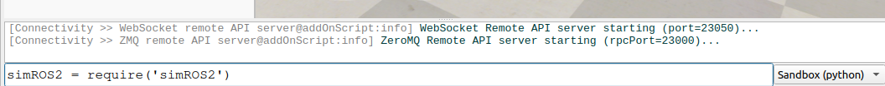

CoppeliaSim
===================

Installation on ``Ubuntu 22.04``
----------------------------------

1. **Download file**

Go to the `website <https://www.coppeliarobotics.com/>`_ and download the CoppeliaSim ``EDU``

.. image:: images/coppelia_install_step1.png
   :width: 600

Select the ``Ubuntu 22.04 [x86_64]`` and download

.. image:: images/coppelia_install_step2.png
   :width: 600

When the download is done, you can find a file ``CoppeliaSim_Edu_V4_9_0_rev2_Ubuntu22_04.tar.xz`` in the Folder ``Downloads``

2. **Extract file**

Right click the downloaded file and choose ``Extract Here``, and wait until the extraction is done. It might take a few minutes. 

.. image:: images/coppelia_install_step3.jpg
   :width: 600

3. **Run the Simulation**

Enter (Left click) the folder ``CoppeliaSim_Edu_V4_9_0_rev2_Ubuntu22_04``. Right click and choose ``Open in Terminal``. You will see a terminal like

Run the command

.. code-block:: console

    ./coppeliaSim.sh

You will see the simulator launching, and you are ready to use it.

Using Python
--------------

1. In a new terminal, Type

.. code-block:: console

   pip install cbor pyzmq

2. After the installation, re-open the CoppeliaSim and you will be asked to choose between ``Lua`` and ``Python``. Select ``Python``.

Using ROS 2 
------------

Make sure you have installed ROS2 Humble, created and sourced the workspace ``~\ros2_ws`` as shown in `Ubuntu and ROS2 Installation Guide <install.html>`_. 

1. **Enable ROS2 Plugin in CoppeliaSim**

In the input of ``Sandbox (python)`` at the very bottom, copy, paste and press ``enter`` on the keyboard 

.. code-block:: console

   simROS2 = require('simROS2')

You will see output in the background terminal as

.. image:: images/coppelia_ros2_step1_out.png
   :width: 600

So the plugin was successfully loaded.

2. **Install 2 ROS2 Packages**

Install dependencies 

.. code-block:: console

    sudo apt-get install xsltproc
    python3 -m pip install xmlschema

Go to the ros2 workspace

.. code-block:: console

    cd ~/ros2_ws/src

Clone the packages ``simROS2``

.. code-block:: console

    git clone https://github.com/CoppeliaRobotics/simROS2.git sim_ros2_interface
    cd sim_ros2_interface
    git checkout coppeliasim-v4.9.0-rev2

.. note::
    If you are not using Version 4.9.0 (rev. 2), replace ``coppeliasim-v4.9.0-rev2`` with the actual CoppeliaSim version you have.

Go to the ros2 workspace

.. code-block:: console

    cd ~/ros2_ws/src

Clone the packages ``ros2_bubble_rob``

.. code-block:: console

    git clone https://github.com/CoppeliaRobotics/ros2_bubble_rob.git
    cd ros2_bubble_rob
    git checkout coppeliasim-v4.9.0-rev2

3. **Compile the packages**

.. code-block:: console

    cd ~/ros2_ws
    export COPPELIASIM_ROOT_DIR=~/Downloads/CoppeliaSim_Edu_V4_9_0_rev2_Ubuntu22_04
    ulimit -s unlimited #otherwise compilation might freeze/crash
    colcon build --symlink-install --cmake-args -DCMAKE_BUILD_TYPE=Release

.. note::
    if you extract CoppeliaSim in other locations, change ``export COPPELIASIM_ROOT_DIR=~/path/to/coppeliaSim/folder``.

4. **Try it OUT**

Launch CoppeliaSim

.. code-block:: console

    cd ~/Downloads/CoppeliaSim_Edu_V4_9_0_rev2_Ubuntu22_04
    ./coppeliaSim.sh

After the software is launched, open another terminal and Type

.. code-block:: console

    ros2 node list

Upon succesful ROS2 Interface load, checking the available nodes gives this:

.. code-block:: console

    ros2 node list
    /sim_ros2_interface

