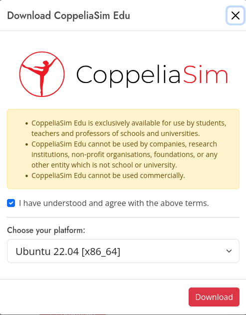

CoppeliaSim
===================

Installation on ``Ubuntu 22.04``
----------------------------------

1. **Download file**

Go to the `website <https://www.coppeliarobotics.com/>`_ and download the CoppeliaSim ``EDU``

.. image:: images/coppelia_install_step1.png
   :width: 600

Select the ``Ubuntu 22.04 [x86_64]`` and download

When the download is done, you can find a file ``CoppeliaSim_Edu_V4_9_0_rev2_Ubuntu22_04.tar.xz`` in the Folder ``Downloads``

2. **Extract file**

Right click the downloaded file and choose ``Extract Here``, and wait until the extraction is done. It might take a few minutes. 

3. **Run the Simulation**

Enter (Left click) the folder ``CoppeliaSim_Edu_V4_9_0_rev2_Ubuntu22_04``. Right click and choose ``Open in Terminal``. You will see a terminal like

.. image:: images/coppelia_install_step4.png
   :width: 600

Run the command

.. code-block:: console
    
    ./coppeliaSim.sh

You will see the simulator launching, and you are ready to use it.

.. image:: images/coppelia_install_step5.png
   :width: 600

