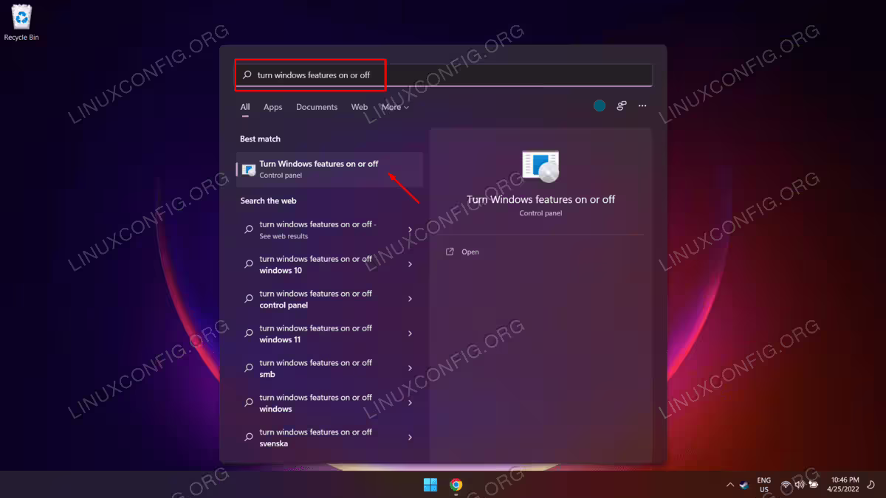
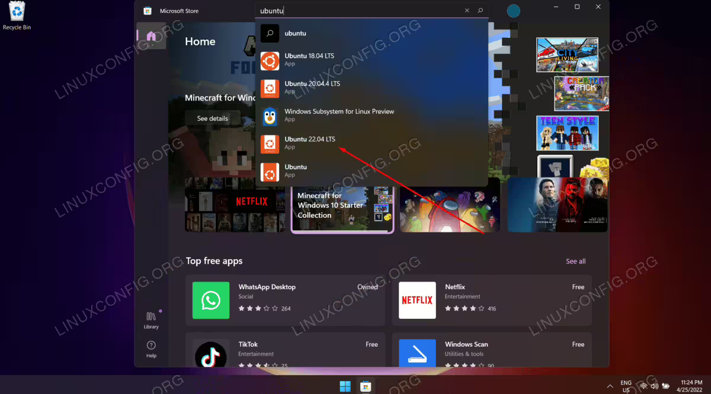
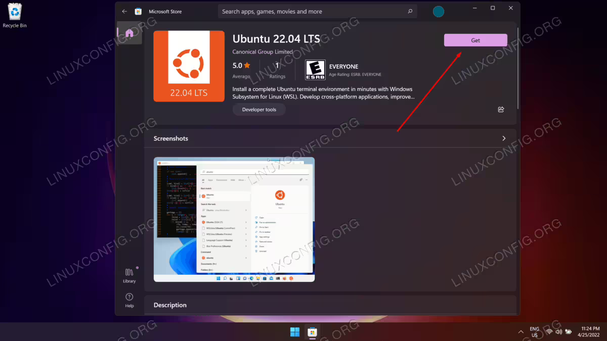
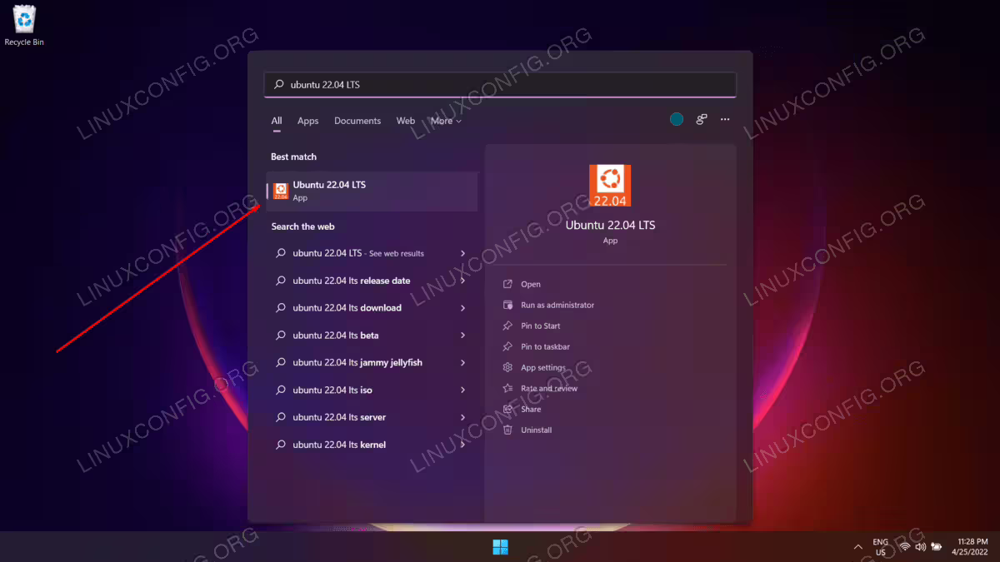
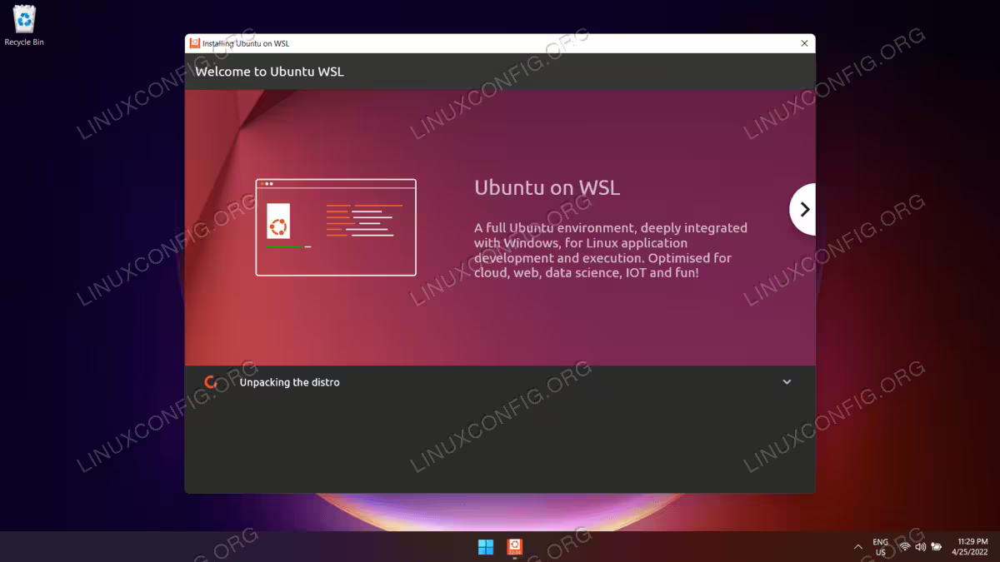
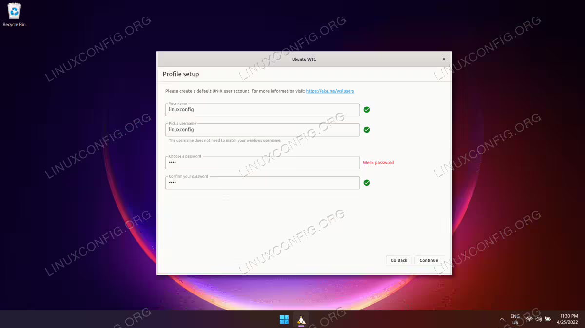
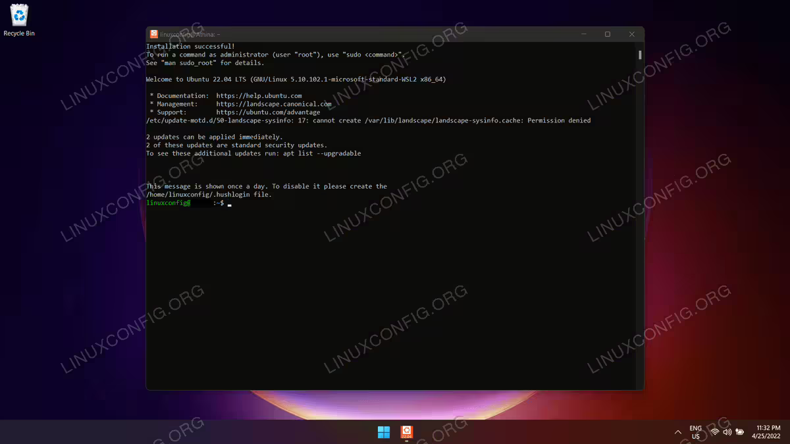
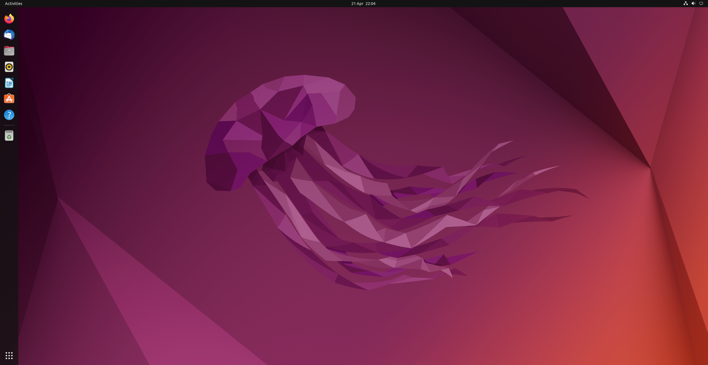

Installation Guide
===================

.. _installation:

This tutorial will briefly introduce the basic tools you are going to use throughout this course and how to install
them. The tools are essential for the homeworks and projects so please make sure you grasp the basic ideas
and all the tools are good to go after you follow this guide.

You will need to use `ROS2 <https://docs.ros.org/en/humble/index.html>`_ (Robot Operating System). ROS2 is easier to install and run in Linux-like
systems. So this tutorial will only introduce how to install ROS2 HUmble on Ubuntu 22.04.5 Jammy Jellyfish. You are free to use other version of ROS2 if you are familiar with this framework (all variants of ROS2
share the same coding conventions). There are three ways to install Ubuntu on your pc: Virtual Machine, Dual-boot, and WSL (Windows Subsystem for Linux).

Virtual Machine ``recommended``
--------------------------------

1. **Download an Ubuntu Image**

You can download an Ubuntu image `here <https://releases.ubuntu.com/jammy/>`_. Make sure to save it to a memorable location on your PC! For this tutorial, we will use the latest Ubuntu 22.04.5 LTS (long term support) release.

.. image:: images/iso.png
   :width: 600

2. **Download and install VirtualBox**

You can download VirtualBox from the `downloads page <https://www.virtualbox.org/wiki/Downloads>`_. Follow instructions on how to install VirtualBox for your specific OS. 
Once you have completed the installation, go ahead and run VirtualBox.

.. image:: images/virtualbox.png
   :width: 600

3. **Create a new virtual machine**

Click New to create a new virtual machine. Fill in the appropriate details:

    - Name: If you include the word Ubuntu in your name the Type and Version will auto-update.
    - Machine Folder: This is where your virtual machines will be stored so you can resume working on them whenever you like.
    - ISO Image: Here you need to add a link to the ISO you downloaded from the Ubuntu website.

.. image:: images/virtual_step1.png
   :width: 600

4. **Create a user profile**

To enable the automatic install we need to prepopulate our username and password here in addition to our machine name so that it can be configured automatically during first boot.

The default credentials are:

    - Username: vboxuser
    - Password: changeme

It is important to change these values since the defaults will create a user without sudo access.

.. note::
    Ensure your Hostname has no spaces to proceed!

.. image:: images/virtual_step2.png
   :width: 600

5. **Define the Virtual Machine’s resources**

In the next section we can specifiy how much of our host machine’s memory and processors the virtual machine can use. For good performance it’s recommended to provide your VM with around 8GB of RAM (althought 4GB will still be usable) and 4 CPUs. Try to remain in the green areas of each slider to prevent issues with your machine running both the VM and the host OS.

.. image:: images/virtual_step3.png
   :width: 600

Then we need to specify the size of the hard disc for the virtual machine. For Ubuntu we recommend around 25 GB as a minimum. By default the hard disk will scale dynamically as more memory is required up to the defined limit. If you want to pre-allocate the full amount, check the ‘Pre-allocate Full Size’ check box. This will improve performance but may take up unnecessary space.

.. image:: images/virtual_step4.png
   :width: 600

Click Next to continue and view a summary of your machine setting. After this click Finish to initialize the machine!

.. image:: images/virtual_step5.png
   :width: 600

6. **Install your image**

Click Start to launch the virtual machine. You will see a message saying 'Powering VM up …' and your desktop window will appear. On first boot the unattended installation will kick in so do not interact with the prompt to ‘Try and Install Ubuntu’ and let it progress automatically to the splash screen and into the installer.

You will notice at this stage that the resolution of the window is fixed at 800x600. This is because the Guest Additions features are not installed until after the Ubuntu installation has completed. 

Once the installation completes, the machine will automatically reboot to complete the installation.

Finally you will be greeted with the Ubuntu log-in screen where you can enter your username and password defined during the initial setup (don’t forget that the default password is ‘changeme’ if you left everything as the default).

Dual-boot
----------

Dual-boot refers to a computer setup in which two operating systems are installed on a single machine,
allowing the user to choose which one to run when the computer starts up.

1. **Download an Ubuntu Image**

You will need to download a ISO file for Ubuntu. Here is the link:
https://releases.ubuntu.com/jammy/
Please select the 64-bit PC (AMD64) desktop image to download.

.. note::
    If you are using macOS Applie Silicone (M1/M2), you may need to download ARM64 version https://cdimage.ubuntu.com/releases/22.04.5/release/ 

`Here <https://www.linuxtechi.com/dual-boot-ubuntu-22-04-and-windows-11/>`_ is a tutorial for installing Ubuntu 22.04 alongside Windows 11, as well as a `video tutorial <https://youtu.be/QKn5U2esuRk/>`_ .

.. note::
    incorrectly setting up a dual-boot system can lead to data loss or system malfunctions. It's crucial to back up important data before attempting to set up a dual-boot system.

WSL (Windows Subsystem for Linux) ``no GUI``
---------------------------------------------------

.. note::
    This method only works with Windows 10 (Version 1903 or higher, with Build 18362 or higher), Windows 11 (Any version). 

We follow the `steps <https://linuxconfig.org/ubuntu-22-04-on-wsl-windows-subsystem-for-linux>`_ for demonstration.

1. **Turn Windows Features ON**

To start, we will need to enable the Vitual Machine Platform module and Windows Subsystem for Linux feature. Open up your Start menu and locate the ``Turn Windows features on or off`` menu. 

2. **Enable Virtual machine platform**

Next, find the ``Virtual Machine Platform`` and ``Windows Subsystem for Linux`` options. Check both of these boxes and then press OK to enable the features. 

.. image:: images/wsl_step2.png
   :width: 600

Windows will make the changes, which may take a minute or two, then ask you to restart your system for the changes to take effect. Proceed with the reboot. 

3. **Microsoft Store**

When your system boots back up, go to your Start menu and find the Microsoft Store. Once there, search for Ubuntu 22.04. 

Once you have located the Ubuntu 22.04 LTS page, click on the “Get” button to download it.

4. **Install Ubuntu 22.04**

Once the download is complete, you can open Ubuntu 22.04 from your Start menu. 

There will be an installation process that appears, and it should not take very long. The distro will be unpacked and ready to use shortly. 

At this time, you will also be asked to create a new user account for Ubuntu 22.04 and some other small configuration settings. 

All done. You can now open Ubuntu 22.04 from your Start menu any time you want to use it. You will be presented with a command line terminal and can execute nearly all the same commands you could on a physical Ubuntu 22.04 machine. 

Play with Your Ubuntu 
-----------------------

A successfully configured Ubuntu 22.04 looks like this: 

Unlike Windows or MacOS, Ubuntu heavily relies on Command Line Tools. You can control your computer through typing in texts (or Commands) in the terminal. On a Ubuntu 20.04 system you can find a launcher for the terminal by clicking on the Activities item at the top left of the screen, then typing the first few letters of “terminal”, “command”, “prompt” or “shell”. Yes, the developers have set up the launcher with all the most
common synonyms, so you should have no problems finding it. If you can’t find a launcher, or if you just want a faster way to bring up the terminal, most Linux systems use the
same default keyboard shortcut to start it: ``Ctrl-Alt-T``.

Install ROS2 Humble 
-----------------------

The steps are adopted from  `here [Ubuntu deb packages] <https://linuxconfig.org/ubuntu-22-04-on-wsl-windows-subsystem-for-linux/>`_ .

1. **Set locale**

Make sure you have a locale which supports ``"UTF-8"``. If you are in a minimal environment (such as a docker container), the locale may be something minimal like  ``"POSIX"``. We test with the following settings. However, it should be fine if you’re using a different UTF-8 supported locale.

.. code-block:: console

   locale  # check for UTF-8
   sudo apt update && sudo apt install locales
   sudo locale-gen en_US en_US.UTF-8
   sudo update-locale LC_ALL=en_US.UTF-8 LANG=en_US.UTF-8
   export LANG=en_US.UTF-8

   locale  # verify settings

2. **Setup Sources**

You will need to add the ROS 2 apt repository to your system.

.. code-block:: console

   sudo apt install software-properties-common
   sudo add-apt-repository universe

Now add the ROS 2 GPG key with apt.

.. code-block:: console

   sudo apt update && sudo apt install curl -y
   sudo curl -sSL https://raw.githubusercontent.com/ros/rosdistro/master/ros.key -o /usr/share/keyrings/ros-archive-keyring.gpg

Then add the repository to your sources list.

.. code-block:: console

   echo "deb [arch=$(dpkg --print-architecture) signed-by=/usr/share/keyrings/ros-archive-keyring.gpg] http://packages.ros.org/ros2/ubuntu $(. /etc/os-release && echo $UBUNTU_CODENAME) main" | sudo tee /etc/apt/sources.list.d/ros2.list > /dev/null

3. **Install ROS 2 packages**

Update your apt repository caches after setting up the repositories.

.. code-block:: console

   sudo apt update

ROS 2 packages are built on frequently updated Ubuntu systems. It is always recommended that you ensure your system is up to date before installing new packages.

.. code-block:: console

   sudo apt upgrade

Desktop Install (Recommended): ROS, RViz, demos, tutorials.

.. code-block:: console

   sudo apt install ros-humble-desktop

Development tools: Compilers and other tools to build ROS packages

.. code-block:: console

   sudo apt install ros-dev-tools

3. **Environment setup**

Add sourcing to your shell startup script

.. code-block:: console

   echo "source /opt/ros/humble/setup.bash" >> ~/.bashrc

4. **Try some examples**

In one terminal, source the setup file and then run a C++ ``talker``

.. code-block:: console

   ros2 run demo_nodes_cpp talker

In another terminal source the setup file and then run a Python ``listener``

.. code-block:: console

   ros2 run demo_nodes_py listener

You should see the talker saying that it’s Publishing messages and the listener saying I heard those messages. This verifies both the C++ and Python APIs are working properly.

5. **Create a Workspace**

Install colcon

.. code-block:: console

   sudo apt install python3-colcon-common-extensions

Create a workspace

.. code-block:: console

   mkdir -p ~/ros2_ws/src
   cd ~/ros2_ws

At this point the workspace contains a single empty directory ``src``

.. code-block:: console

   .
   └── src

   1 directory, 0 files

Add some sources

Let's clone the `examples <https://github.com/ros2/examples/>`_ repository into the ``src`` directory of the workspace:

.. code-block:: console

   git clone https://github.com/ros2/examples src/examples -b humble

Now the workspace should have the source code to the ROS 2 examples:

.. code-block:: console

   .
   └── src
      └── examples
         ├── CONTRIBUTING.md
         ├── LICENSE
         ├── rclcpp
         ├── rclpy
         └── README.md

   4 directories, 3 files

6. **Build the workspace**

In the root of the workspace, run ``colcon build``. ``--symlink-install`` allows the installed files to be changed by changing the files in the source space (e.g. Python files or other non-compiled resources) for faster iteration.

.. code-block:: console

   cd ~/ros2_ws
   colcon build --symlink-install

After the build is finished, we should see the ``build``, ``install``, and ``log`` directories

.. code-block:: console

   .
   ├── build
   ├── install
   ├── log
   └── src

   4 directories, 0 files

7. **Run tests**

To run tests for the packages we just built, run the following:

.. code-block:: console

   colcon test

8. **Source the environment**

When colcon has completed building successfully, the output will be in the install directory. Before you can use any of the installed executables or libraries, you will need to add them to your path and library paths. colcon will have generated bash/bat files in the install directory to help set up the environment. These files will add all of the required elements to your path and library paths as well as provide any bash or shell commands exported by packages.

.. code-block:: console

   echo "source ~/ros_ws/install/setup.bash" >> ~/.bashrc

9. **Try a demo**

With the environment sourced, we can run executables built by colcon. Open a new terminal, run a subscriber node from the examples:

.. code-block:: console

   ros2 run examples_rclcpp_minimal_subscriber subscriber_member_function

In another terminal, let’s run a publisher node

.. code-block:: console
   
   ros2 run examples_rclcpp_minimal_publisher publisher_member_function

You should see messages from the publisher and subscriber with numbers incrementing.

More to read
==============

https://docs.ros.org/en/humble/Tutorials.html