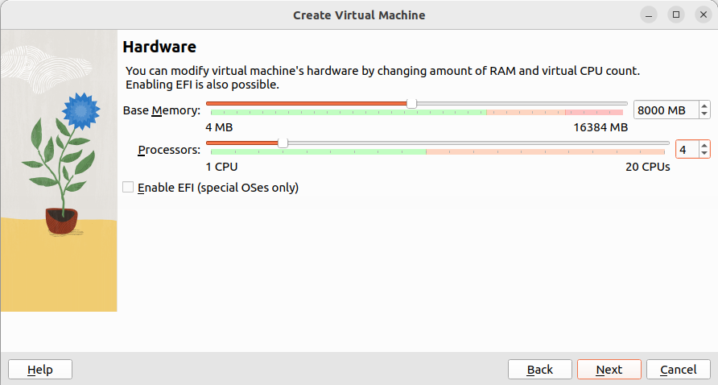

Installation Guide
===================

.. _installation:

This tutorial will briefly introduce the basic tools you are going to use throughout this course and how to install
them. The tools are essential for the homeworks and projects so please make sure you grasp the basic ideas
and all the tools are good to go after you follow this guide.

You will need to use `ROS2 <https://docs.ros.org/en/humble/index.html>`_ (Robot Operating System). ROS2 is easier to install and run in Linux-like
systems. So this tutorial will only introduce how to install ROS2 HUmble on Ubuntu 22.04.5 Jammy Jellyfish. You are free to use other version of ROS2 if you are familiar with this framework (all variants of ROS2
share the same coding conventions). There are three ways to install Ubuntu on your pc: Virtual Machine, Dual-boot, and WSL (Windows Subsystem for Linux).

Virtual Machine ``recommended``
--------------------------------

1. **Download an Ubuntu Image**

You can download an Ubuntu image `here <https://releases.ubuntu.com/jammy/>`_. Make sure to save it to a memorable location on your PC! For this tutorial, we will use the latest Ubuntu 22.04.5 LTS (long term support) release.

2. **Download and install VirtualBox**

You can download VirtualBox from the `downloads page <https://www.virtualbox.org/wiki/Downloads>`_. Follow instructions on how to install VirtualBox for your specific OS. 
Once you have completed the installation, go ahead and run VirtualBox.

3. **Create a new virtual machine**

Click New to create a new virtual machine. Fill in the appropriate details:

    - Name: If you include the word Ubuntu in your name the Type and Version will auto-update.
    - Machine Folder: This is where your virtual machines will be stored so you can resume working on them whenever you like.
    - ISO Image: Here you need to add a link to the ISO you downloaded from the Ubuntu website.

.. image:: images/virtual_step1.png
   :width: 600

4. **Create a user profile**

To enable the automatic install we need to prepopulate our username and password here in addition to our machine name so that it can be configured automatically during first boot.

The default credentials are:

    - Username: vboxuser
    - Password: changeme

It is important to change these values since the defaults will create a user without sudo access.

.. note::
    Ensure your Hostname has no spaces to proceed!

.. image:: images/virtual_step2.png
   :width: 600

5. **Define the Virtual Machine’s resources**

In the next section we can specifiy how much of our host machine’s memory and processors the virtual machine can use. For good performance it’s recommended to provide your VM with around 8GB of RAM (althought 4GB will still be usable) and 4 CPUs. Try to remain in the green areas of each slider to prevent issues with your machine running both the VM and the host OS.

Then we need to specify the size of the hard disc for the virtual machine. For Ubuntu we recommend around 25 GB as a minimum. By default the hard disk will scale dynamically as more memory is required up to the defined limit. If you want to pre-allocate the full amount, check the ‘Pre-allocate Full Size’ check box. This will improve performance but may take up unnecessary space.

Click Next to continue and view a summary of your machine setting. After this click Finish to initialize the machine!

6. **Install your image**

Click Start to launch the virtual machine. You will see a message saying 'Powering VM up …' and your desktop window will appear. On first boot the unattended installation will kick in so do not interact with the prompt to ‘Try and Install Ubuntu’ and let it progress automatically to the splash screen and into the installer.

You will notice at this stage that the resolution of the window is fixed at 800x600. This is because the Guest Additions features are not installed until after the Ubuntu installation has completed. 

Once the installation completes, the machine will automatically reboot to complete the installation.

Finally you will be greeted with the Ubuntu log-in screen where you can enter your username and password defined during the initial setup (don’t forget that the default password is ‘changeme’ if you left everything as the default).

WSL (Windows Subsystem for Linux)
--------------------------------

.. note::
    This method only works with Windows 10 (Version 1903 or higher, with Build 18362 or higher), Windows 11 (Any version). 

